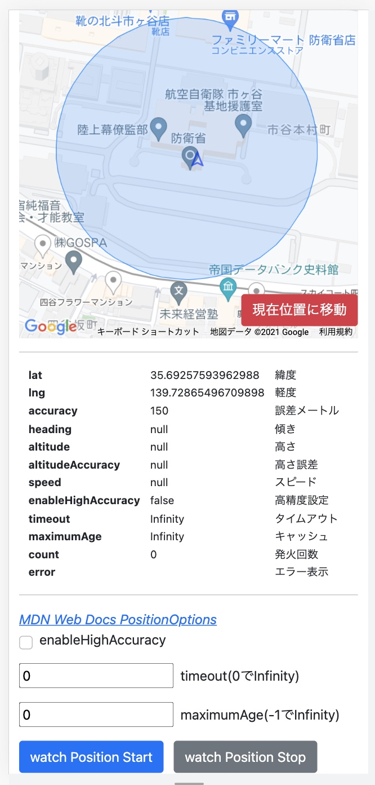

# [Geolocation.watchPositionオプションお試しページ](https://rahhi555.github.io/geolocation-check/)

Geolocation.watchPositionのオプションってどのくらい効果があるのか気になったので検証できるページを公開しました。

1. 「現在位置に移動」ボタンを押す
2. ページ下のフォームにwatchPositionで指定できるオプションを入力する
3. 「watch Position Start」を押すと位置情報の監視が開始され、地図上の現在位置アイコンに反映される
4. 監視を辞める場合は「watch Position Stop」を押す

